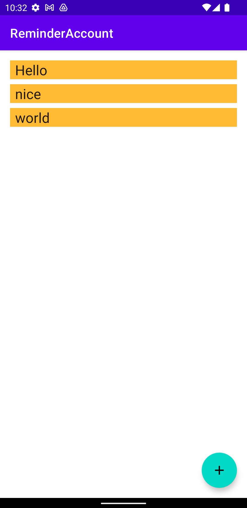

# AppWithKotlin

## perpose

> 평소 계정 로그인을 할때 비밀번호를 여러가지 사용하거나 비밀번호 대신에 토큰을 사용하게 되면서 외워야하고 외울 수 없는 개인정보들이 많아졌습니다. 따라서 저는 이를 해결하고자 간단한 crud 앱을 만들어보자 메모장보다는 간
단하고 사용하기 편한 앱을 만들자 하는 취지에서 다음 앱을 구현하였습니다.

## how to use

1. 우측 하단에 십자 표시가 된 아이콘을 누른다. 
2. 저장할 계정 정보를 넣는다.
3. 잘 저장되었는지 확인한다.
4. 세부사항을 보고 싶다면 해당 계정의 이름을 클릭한다.
5. 정보를 확인한다.

      

## how to make
 - create/update
 >원래 계획은 객체의 create와 update를 구분하여서 제작하려고 했으나 좀 더 가볍게 사용하고자 이 둘을 하나로 합쳤습니다.
 
 ~~~
 @Entity(tableName = "account_table")
 data class Account(
    @PrimaryKey
    @ColumnInfo(name = "name")
    val name:String,
    @ColumnInfo
    val id:String,
    @ColumnInfo
    val pwd:String,
    @ColumnInfo
    val token:String,
  )
 ~~~

> db에 저장되는 entity의 코드가 위 코드입니다. pk를 따로 숫자로 설정하지 않고 account의 이름을 pk로 설정함으로 같은 이름의 entity를 만들려고 하면 해당 entity를 교체하는 방식으로 제작했습니다.

~~~
@Dao
interface AccountDao {

    @Query("SELECT * FROM account_table ORDER BY name ASC")
    fun getAlphabetizedWords(): Flow<List<Account>>

    @Insert(onConflict = OnConflictStrategy.REPLACE) // 해당 부분에서 같은 pk로 인해 충돌이 발생시 그 entity를 교체하는 것으로 설정
    suspend fun insert(word: Account)
    ...
}
~~~

>add activity를 통해서 사용자로부터 정보를 받고 intent를 통해서 main Activity에서 사용자로부터 받은 정보를 db에 저장 recyclerview를 통해서 출력이 자연스럽게 진행됩니다.

 - read
 > 읽은 방법은 간단합니다. 메인 엑티비티에서 리사이클러 뷰를 사용하여 db에 저장되어 있는 정보들의 pk값, 즉 이름을 출력하도록 만들었습니다. 이렇게만 만들면 사용자가 추가적으로 넣은 id,pwd, token과 같은 정보는 
 출력이 되지 않기 때문에 이를 보여주는 detail 엑티비티를 따로 구현하였고 이를 보기 위해서는 리사이클러뷰의 각 view에 클릭리스너를 설정하여서 세부사항을 볼 수 있도록 구현하였습니다.
 이때 정보는 intent를 사용하여서 main -> detail  activity로 정보를 넘겨주었습니다.
 
 - delete
 > detail activity에서 세부 정보를 볼수도 있고 지울 수도 있도록 버튼을 만들어서 기능을 지원하고 있습니다.

